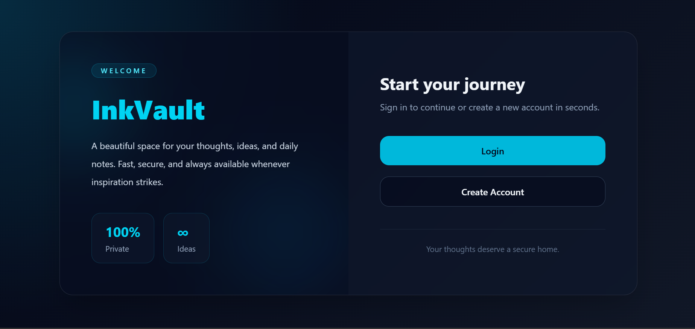
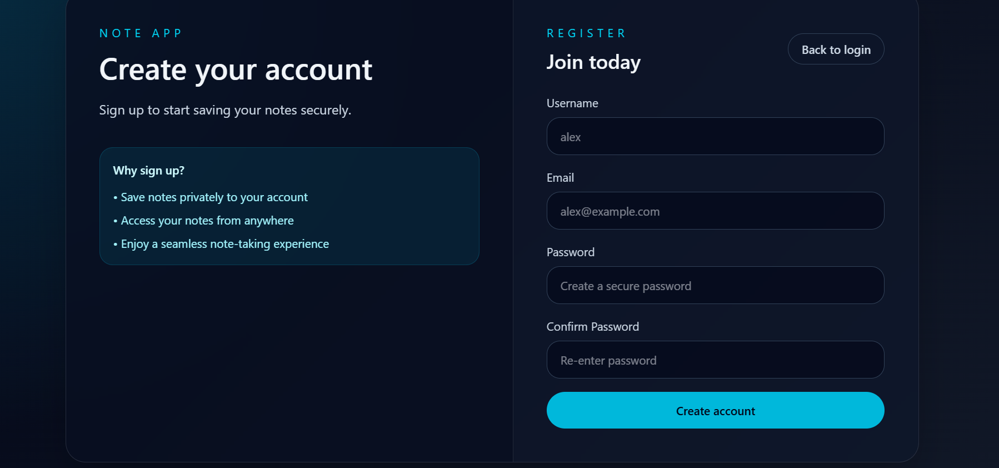
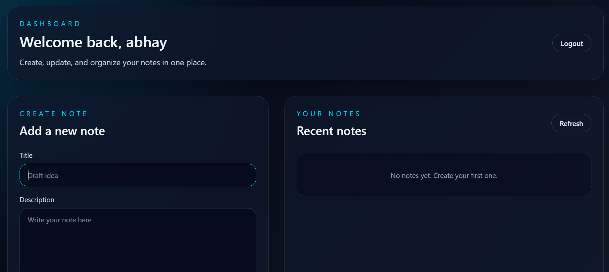

<div align="center">

# 📝 InkVault - Modern Note Taking App

### Secure • Fast • Responsive

A modern full-stack note-taking application built with **React 19**, **Vite**, **Tailwind CSS**, **Express.js**, and **MongoDB**, featuring secure **JWT Authentication** using HTTP-only cookies.

<p>
<a href="https://noteapp-front.netlify.app">

</a>


</p>

**🚀 Live Demo:** https://noteapp-front.netlify.app

</div>

---

# ✨ Features

- 🔐 Cookie-based JWT Authentication
- 📝 Create, Update & Delete Notes
- 📂 Personal Dashboard
- ⚡ Fast CRUD Operations
- 🎨 Beautiful Modern UI
- 📱 Fully Responsive
- ☁️ MongoDB Atlas Integration
- 🔒 Protected Routes
- 🌐 Production Ready Deployment

---

# 📸 Screenshots

## 🏠 Landing Page

<p align="center">

</p>

---

## 📝 Register Page

<p align="center">

</p>

---

## 📋 Dashboard

<p align="center">

</p>

---

# 🏗️ Tech Stack

### Frontend

- React 19
- Vite
- Tailwind CSS
- Axios

### Backend

- Node.js
- Express.js 5

### Database

- MongoDB Atlas
- Mongoose

### Authentication

- JWT
- HTTP-only Cookies
- bcrypt

---

# 📁 Project Structure

```
noteapp/
├── backend/      # Express API
└── frontend/     # React + Vite
```

---

# 🌍 Live Deployment

| Service | URL |
|---------|-----|
| Frontend | https://noteapp-front.netlify.app |
| Backend | Render |

---

# 🚀 Why Render + Netlify?

The frontend is deployed on **Netlify**, while the backend runs on **Render**.

### Why not Vercel?

Vercel executes the backend as **serverless functions**. Each request may create a fresh instance, requiring a new MongoDB connection. On the free Hobby plan with MongoDB Atlas, this can occasionally lead to **cold starts** and **504 timeout errors**.

Render keeps the Express server running as a **long-lived Node.js process**, maintaining a persistent MongoDB connection. This architecture provides better reliability for applications with continuous database interactions.

---

# ⚙️ Environment Variables

## Backend

```env
PORT=5000
MONGO_URI=your_mongodb_uri
JWT_SECRET=your_secret_key
CLIENT_URL=http://localhost:5173
NODE_ENV=development
```

## Frontend

```env
VITE_API_URL=http://localhost:5000
```

---

# 💻 Local Development

## Clone Repository

```bash
git clone https://github.com/yourusername/noteapp.git
cd noteapp
```

---

## Backend

```bash
cd backend

cp .env.example .env

npm install

npm run dev
```

Runs on:

```
http://localhost:5000
```

---

## Frontend

```bash
cd frontend

cp .env.example .env

npm install

npm run dev
```

Runs on:

```
http://localhost:5173
```

---

# 🚀 Deployment

## Backend (Render)

- Root Directory: `backend`
- Build Command

```bash
npm install
```

- Start Command

```bash
npm start
```

Environment Variables

```
MONGO_URI
JWT_SECRET
NODE_ENV=production
CLIENT_URL=<Netlify URL>
```

---

## Frontend (Netlify)

Base Directory

```
frontend
```

Build Command

```bash
npm run build
```

Publish Directory

```
frontend/dist
```

Environment Variable

```
VITE_API_URL=<Render Backend URL>
```

---

# 📌 Render Free Tier Note

Render's free services automatically spin down after **15 minutes** of inactivity.

The first request after being idle may take **30–60 seconds** while the server wakes up. Subsequent requests are fast.

---

# 🎯 Future Improvements

- ⭐ Pin Notes
- 📁 Categories
- 🏷 Tags
- 🔍 Search Notes
- 📤 Export Notes
- 🤝 Share Notes
- 🌙 Light/Dark Theme

---

# 👨‍💻 Author

### Abhay Singh

GitHub: https://github.com/Abhay2110s

---

<div align="center">

### ⭐ Star this repository if you found it useful!

Made with ❤️ by Abhay Singh

</div>
